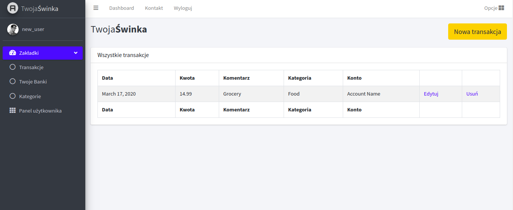

* still in develop 

## available to test!

[Check how it works!](http://shorturl.at/jsQY5)


AWS Hosting and database

# PiggyBank

Is an app to manage you home budget with maximum customisation. Just create account and start using it. 
- add transactions
- categories
- accounts in various currencies
- create and plan you monthly budgets for each category

## Technology

```bash
python3
django 2.2.7
```
## Requirements

```bash
django==3.0.5
beautifulscraper==1.1.1
selenium==3.141.0
urllib3==1.25.8
pytz==2019.3
asgiref==3.2.7
setuptools==40.8.0
sqlparse==0.3.1
psycopg2-binary==2.8.5
```
## As front end

I've used BootStrap Admin LTE.

## How it is look like
#dashboard

#transactions

#accounts


## Contributing
Pull requests are welcome. For major changes, please open an issue first to discuss what you would like to change.

Please make sure to update tests as appropriate.

